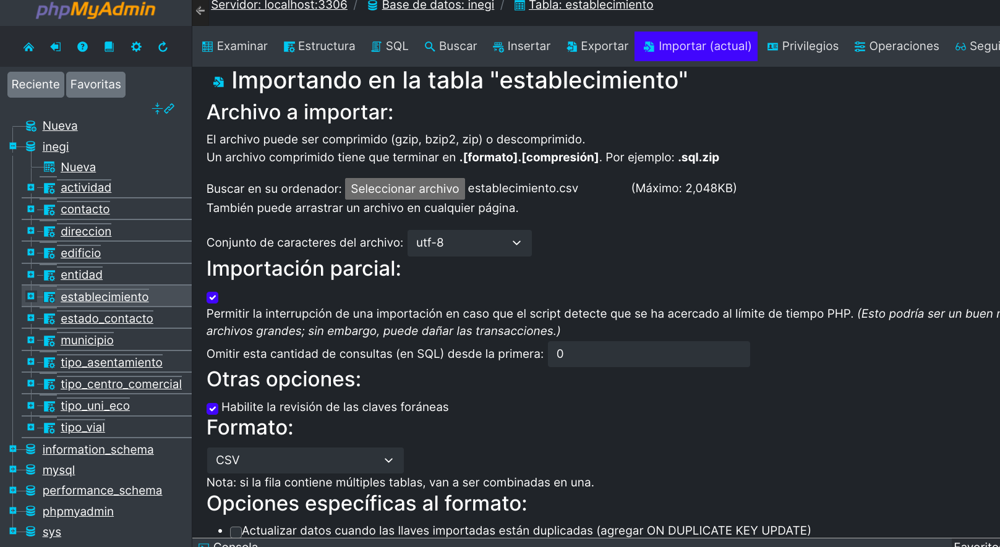

# Migración de Datos desde Excel a MySQL

## Método de Migración

### 1. **Conversión de Excel a CSV**
   - Los 138,123 registros fueron exportados desde Excel a un archivo **CSV**.
   - Se eligieron delimitadores adecuados (coma o punto y coma) para garantizar la correcta lectura de los datos.

### 2. **División del Archivo CSV**
   - Debido al límite de tamaño de **2 MB** en **phpMyAdmin**, se desarrolló un **script en Python** para dividir el archivo CSV en partes más pequeñas.
   - Cada subarchivo contiene un número adecuado de registros para mantenerse dentro del límite de tamaño permitido.

### 3. **Importación a MySQL**
   - Se creó una **base de datos** y las **tablas correspondientes** en MySQL.
   - Los datos fueron importados a MySQL, validando su **integridad** en todo momento.
   

## Problemas Encontrados y Soluciones

### 1. **Límite de Tamaño en phpMyAdmin**
   - **Problema:** PhpMyAdmin solo permite subir archivos de hasta 2 MB.
   - **Solución:** Se desarrolló un **script en Python** para dividir el archivo CSV en partes más pequeñas, permitiendo la importación sin superar el límite.

### 2. **Problemas con la Codificación de Caracteres**
   - **Problema:** Algunos caracteres especiales (tildes, eñes) no se mostraban correctamente.
   - **Solución:** Se garantizó que el archivo CSV estuviera en **UTF-8 sin BOM**.

### 3. **Error en los Tipos de Datos**
   - **Problema:** Algunas columnas contenían valores inesperados, causando errores en la importación a MySQL.
   - **Solución:** Se validaron los datos antes de la importación:
     - Se corrigieron los **valores nulos** e inconsistencias.
     - Se utilizaron tipos de datos adecuados en las columnas (**INT**, **VARCHAR**, **JSON**, etc.) para evitar errores.

## Conclusión

La migración fue exitosa, asegurando que los **138,123 registros** fueron importados a MySQL sin problemas. Se implementaron soluciones eficientes para superar los obstáculos encontrados durante el proceso, garantizando la integridad y correcta codificación de los datos.
